# 出租车费用预测 (Taxi Fare Prediction) with Vertex AI

## 使用许可代码声明
本项目中使用了经过修改的第三方许可代码，遵循以下规范：
- 原始许可来源：[chicago_taxi_fare_prediction.ipynb
](https://github.com/GoogleCloudPlatform/vertex-ai-samples/blob/main/notebooks/official/workbench/chicago_taxi_fare_prediction/chicago_taxi_fare_prediction.ipynb) 
- 修改后的代码遵循原许可协议（如 Apache 2.0 / MIT 等）要求

-------
## 项目简介

> 原本数据源是关于电车，由于客户隐私，所以数据源换成了芝加哥出租车数据。
 
> 本项目演示如何在 Google Cloud Vertex AI 上构建、训练和部署一个机器学习模型，用于预测芝加哥出租车费用。整个流程涵盖数据提取、预处理、探索性数据分析（EDA）、特征工程、模型训练、评估、部署及可解释性分析。

-------
## 项目概览
- 目标：预测出租车行程总费用 (trip_pricing_total)。
- 数据来源：bigquery-public-data.chicago_taxi_trips
- 机器学习算法：岭回归 (Ridge Regression, Scikit-learn)
- 使用的是 Ridge 回归（岭回归）模型，其预测公式与线性回归相同，只是系数由 L2 正则化调整。
- 使用的云服务：
    - Google BigQuery（数据提取）
    - Google Cloud Storage（模型存储）
    - Google Vertex AI（模型训练、部署及解释）

-------
## 环境准备

- Python 3.11+
- Google Cloud SDK 已安装并配置你
- 服务账号 JSON 文件（需要 Vertex AI Administrator / BigQuery Admin / Storage Admin）

-------
### 安装依赖

```bash
python3.11 -m pip install python-dotenv
python3.11 -m pip install matplotlib
python3.11 -m pip install pandas
python3.11 -m pip install db-dtypes
python3.11 -m pip install google-cloud-bigquery-storage
python3.11 -m pip install seaborn
python3.11 -m pip install scikit-learn   
```
-------
## 操作步骤
- 细节步骤：
    - 数据提取
        - 从 BigQuery 查询出租车数据。
        - 数据筛选条件：
            - 有效的行程时间、距离和费用。
            - 去除异常值和极端数据。

    - 数据探索 (EDA)
        - 使用 直方图 和 箱线图 可视化数据分布。
        - 创建新特征：
            - trip_hours = 行程小时数
            - trip_speed = 平均速度 (英里/小时)
        - 分析分类特征 (payment_type, 上车/下车社区区域)。
        - 对数值特征生成散点矩阵图 (pairplot) 分析相关性。

    - 特征工程
        - 编码 payment_type（信用卡 → 0，现金 → 1）。
        - 从时间戳提取 星期几 和 小时。
        - 将分类变量转换为数值。
        - 二值化特征：
            - 周末/工作日
            - 白天/夜间

    - 模型训练
        - 使用的以下特征：
            - trip_seconds, trip_miles, payment_type, pickup_community_area, dropoff_community_area, dayofweek, hour, trip_speed
        - 划分训练集（75%）和测试集（25%）
        - 使用 Ridge 回归模型（岭回归），并通过 GridSearchCV 调优超参数 α。

    - 模型评估
        - 指标
            - R² 分数
            - RMSE (均方根误差)
        - 可视化特征系数。

    - 模型部署
        - 保存模型本地文件 (model.pkl) 并上传至 Google Cloud Storage。
        - 在 Vertex AI 上部署模型：
            - 容器：sklearn-cpu.1-6
            - 机器类型：n1-standard-4
            - 创建并绑定到 Vertex AI 端点。

    - 可解释性分析 (Sampled Shapley)
        - 启用可解释性 AI，使用 Sampled Shapley Attribution。
        - 查看每个特征对预测的贡献。
        - 用条形图可视化特征重要性。

- 文件运行
    - 本地运行
        - 本地自动化化运行 -> 二选一
            - main.py
            - custom_pipeline.py -> LocalPipeline()
        - 本地手动运行
            - credentials
            - dataset
            - data preprocess
            - training
            - upload gcs
            - model upload
            - create endpoint
            - deploy endpoint 
            - local_custom_model_test
    - Remote运行：
        - remote 自动化运行
            - custom_pipeline.py -> RemotePipeline()
        - remote 手动运行
            - cmin_value = cj.CustomJobHyperparameterTuningJob()
            - cj.CustomJob(min_value)
            - model_resource_name = mu.ModelUpLoad()
            - endpoint_resource_name = ce.CreateEndpoint()
            - de.DeployEndpoint(model_resource_name,endpoint_resource_name)
    - 本地文件说明
        - main.py / custom_pipeline.py -> LocalPipeline() → 主流程脚本 
        - 其他py，拆分主流程脚本，便于阅读和调试
        - model.pkl → 训练好的岭回归模型（Ridge Regression with best α）
        - images → 存放可视化图片
        - README.md → 项目文档

-------

## 模型部署&使用说明

1️⃣ 使用 venv（Python 3.11+ 内置）
1. 克隆git：
```shell
git clone https://github.com/kade-chen/machine-learning.git
```

2. 创建虚拟环境：
```shell
python3.11 -m venv env
```

3. 激活虚拟环境：
    - macOS / Linux
    ```shell
    source env/bin/activate
    ```

    - Windows (cmd)
    ```shell
    env\Scripts\activate.bat
    ```

    - Windows (PowerShell)
    ```shell
    env\Scripts\Activate.ps1
    ```

    - 退出虚拟环境
    ```shell
    deactivate
    ```

4. 验证激活:
```shell
# 激活后，命令行前面会显示 (env)
which python3.11   # macOS/Linux
where python3.11   # Windows
```

5. 安装依赖：
```shell
python3.11 -m pip install google-cloud-aiplatform google-cloud-storage google-cloud-bigquery scikit-learn matplotlib seaborn pandas
```

6. 设置 GCP 身份验证：
```shell
export GOOGLE_APPLICATION_CREDENTIALS="path/to/service-account.json"
```

7. 运行项目（请用流水线的方式执行）：
    - 运行流水线任务：
    ```shell
    python3.11 custom_pipeline.py -> RemotePipeline()
    ```
    - 运行细节任务：
        - 认证：
            -  python3.11 credentials.py
        - 数据准备：
            -  数据导入bq：
                -  python3.11 dataset.py -> CreateImportDataset()
            -  数据验证：
                -  python3.11 dataset.py -> QueryDataset()
        - 数据处理：
            -  python3.11 data_preprocess.py
        - 模型训练：
            -  python3.11 model_train.py
        - 模型本地测试(可忽略)：
            -   python3.11 local_custom_model_test.py

                ```shell
                    预测结果: 46.62062950157062

                    每个特征的贡献:
                    trip_seconds: 6000.0 * 0.0072 = 43.0008
                    trip_miles: 4.2 * 1.5055 = 6.3233
                    payment_type: 2.0 * -3.5675 = -7.1350
                    pickup_community_area: 18.0 * 0.0772 = 1.3888
                    dropoff_community_area: 30.0 * 0.0131 = 0.3918
                    dayofweek: 10.0 * -0.7642 = -7.6423
                    hour: 11.0 * -0.7064 = -7.7706
                    trip_speed: 129.2 * 0.1109 = 14.3304

                    截距: 3.733514792525707
                    预测值 = 截距 + 特征贡献之和 = 46.62062950157062
                ```
        - 上传模型到gcs：
            -  python3.11 uploadgcs.py
        - 模型注册到Vertex AI：
            -  python3.11 modelupload.py
            ```shell
                gs://xxxxxxxxx/xxxxxxxxx/
                Creating Model
                Create Model backing LRO: projects/xxxxxxxxx/locations/us-central1/models/xxxxxxxxx/operations/xxxxxxxxx
                Model created. Resource name: projects/xxxxxxxxx/locations/us-central1/models/xxxxxxxxx@1
                To use this Model in another session:
                model = aiplatform.Model('projects/xxxxxxxxx/locations/us-central1/models/xxxxxxxxx@1')
                kade_taxi_fare_prediction_model
                projects/xxxxxxxxx/locations/us-central1/models/xxxxxxxxx
            ```
        - 创建端点：
            -  python3.11 createEndpoint.py
            ```shell
                Creating Endpoint
                Create Endpoint backing LRO: projects/xxxxxxx/locations/us-central1/endpoints/xxxxxxx/operations/xxxxxxx
                Endpoint created. Resource name: projects/xxxxxxx/locations/us-central1/endpoints/xxxxxxx
                To use this Endpoint in another session:
                endpoint = aiplatform.Endpoint('projects/xxxxxxx/locations/us-central1/endpoints/xxxxxxx')
                kade_taxi_fare_prediction_endpoint
                projects/xxxxxxx/locations/us-central1/endpoints/xxxxxxx
            ```
        - 部署端点:
            -  python3.11 deployEndpoint.py -> 注意传入参数
            ```shell
                Deploying model to Endpoint : projects/xxxxxxx/locations/us-central1/endpoints/xxxxxxx
                Deploy Endpoint model backing LRO: projects/xxxxxxx/locations/us-central1/endpoints/xxxxxxx/operations/xxxxxxx
                Endpoint model deployed. Resource name: projects/xxxxxxx/locations/us-central1/endpoints/xxxxxxx    
            ```
        - 模型评估:
            -  执行模型评估
                -  python3.11 custom_job.py -> CustomEvaluationJob() -> 注意传入参数
                -  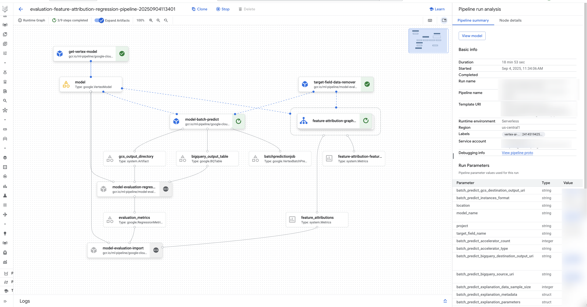
            -  获取模型指标
                -  python3.11 custom_job.py -> CustomEvaluationMetricsJob() -> 注意传入参数
8. 端点测试
    - 8.1 创建一个 JSON 对象来保存您的数据。
    - ```shell 
        echo '{
        "instances": [
            [600, 2.5, 0, 8, 10, 1, 1, 30.0],
            [1200, 5.0, 1, 12, 15, 0, 0, 25.0]
        ]
        }' > input.json
        ```
    - 8.2 创建环境变量来保存您的端点和项目 ID 以及您的 JSON 对象。
    - ```shell 
        ENDPOINT_ID="xxxxx"
        PROJECT_ID="xxxxxx"
        INPUT_DATA_FILE="input.json"
      ```
    - 8.3 执行请求
    - ```shell 
        curl \
        -X POST \
        -H "Authorization: Bearer $(gcloud auth print-access-token)" \
        -H "Content-Type: application/json" \
        "https://us-central1-aiplatform.googleapis.com/v1/projects/${PROJECT_ID}/locations/us-central1/endpoints/${ENDPOINT_ID}:predict" \
        -d "@${INPUT_DATA_FILE}"
      ```
    - 8.4 整合请求 
    - ```shell 
        curl -X POST \
        -H "Authorization: Bearer $(gcloud auth print-access-token)" \
        -H "Content-Type: application/json" \
        "https://us-central1-aiplatform.googleapis.com/v1/projects/${PROJECT_ID}/locations/us-central1/endpoints/${ENDPOINT_ID}:predict" \
        -d '{
            "instances": [
            [600, 2.5, 0, 8, 10, 1, 1, 30.0],
            [1200, 5.0, 1, 12, 15, 0, 0, 25.0]
            ]
        }'
      ```
    - 8.5 示例输出
    - 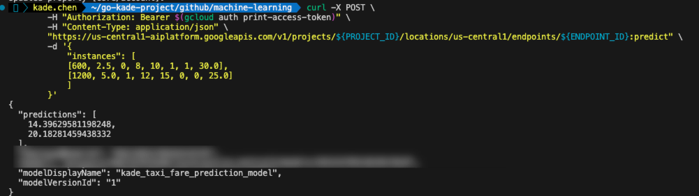
    - 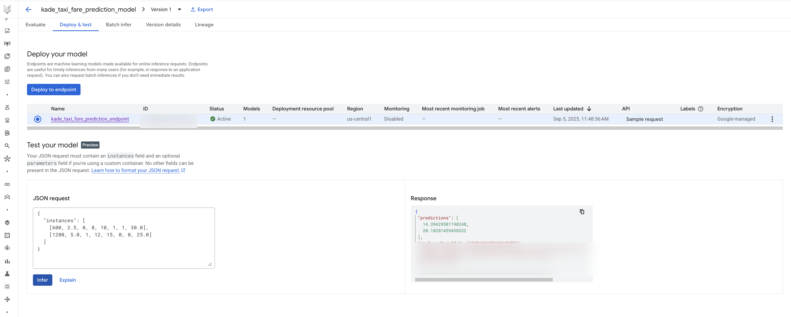
-------
## 训练

### 训练规划
- 数据清洗&数据探索
    - 基础数据展示
        - 直方图（Histogram）：看数据的分布情况，比如集中在哪些值，是否偏斜，是否有多峰等。
        - 箱线图（Boxplot）：看数据的分布情况和异常值（离群点）。

        - 初始直方图/箱线图
            - trip_seconds（行程时间，单位是秒）
            - trip_miles（行程距离，单位是英里）
            - trip_pricing_total （出租车行程总费用）

                - trip_seconds 直方图/箱线图
                - 

                - trip_miles 直方图/箱线图
                - 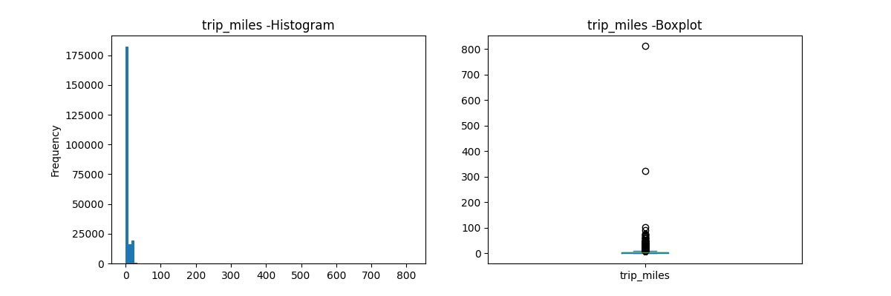

                - trip_pricing_total 直方图/箱线图
                - 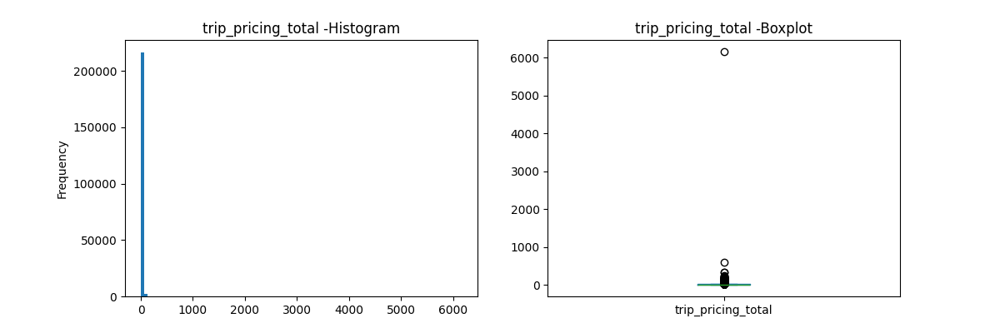
    - 数据清洗后展示
        - trip_seconds 数值转换
            - trip_seconds 换算成小时，可以看出行程时间的分布情况和异常值
            - 
        - trip_speed 数值转换
            - trip_speed 换算成小时，可以看出行程时间的分布情况和异常值
            - 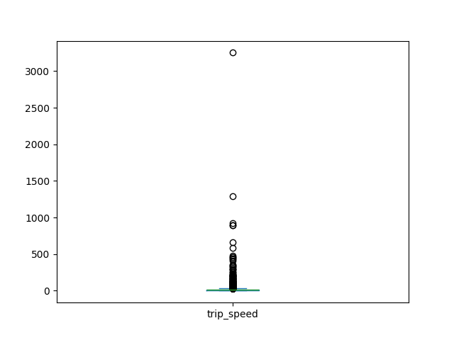
        - Linear 数据展示
            - 抽取200k数据，画出里程与价格的线性关系图
            - 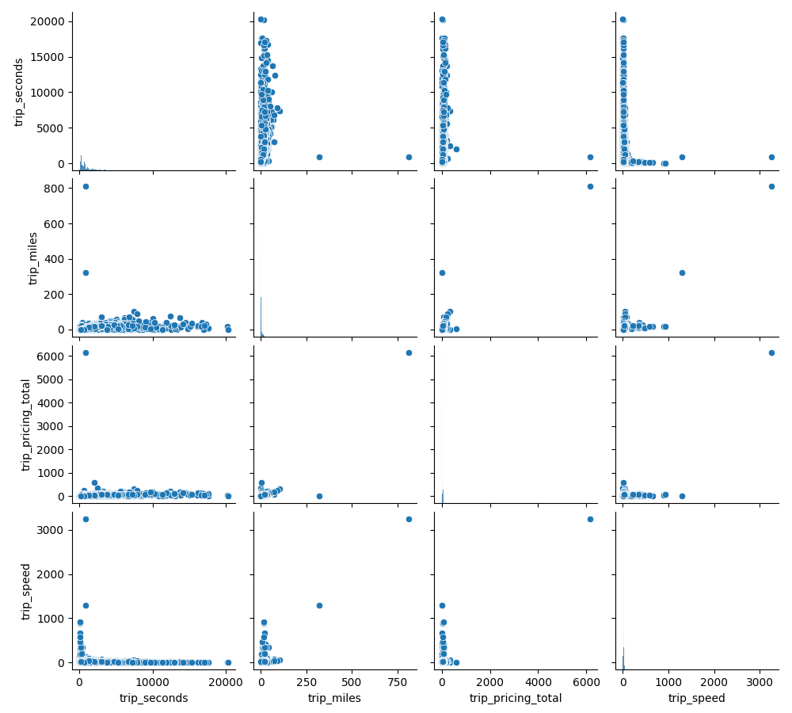
        - 剔除异常值
            - trip_pricing_total 剔除 <= 3 的异常值（总价太低可能异常）
            - trip_miles 剔除 0-300 英里之间，过滤异常里程
            - trip_seconds 剔除行程时间少于2分钟的数据
            - trip_hours 乘车时间最多2小时
            - trip_speed 剔除异常速度，行驶速度限制在每小时70英里以内
- 特征工程
    - 原始特征图像
        - 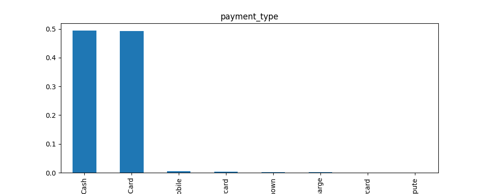
        - 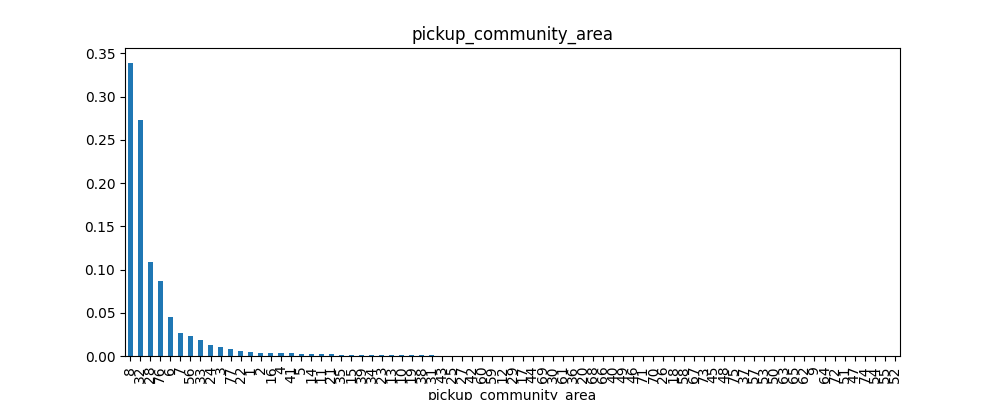
        - 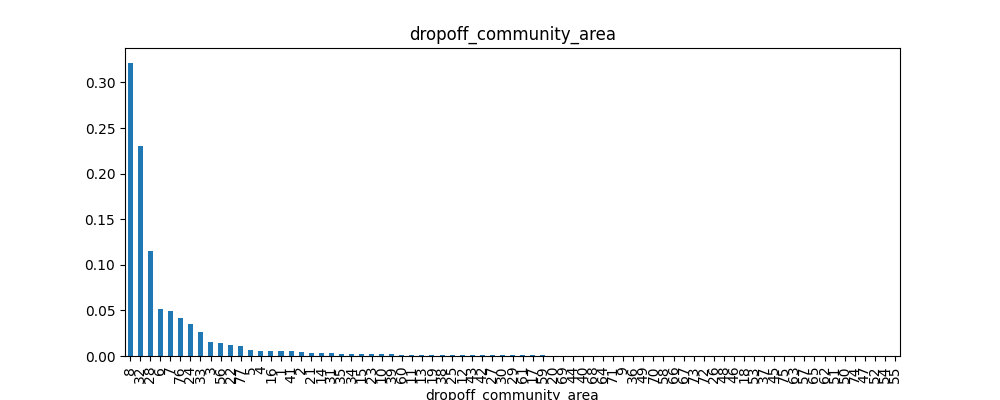
    - 调优后的特征图像
        - 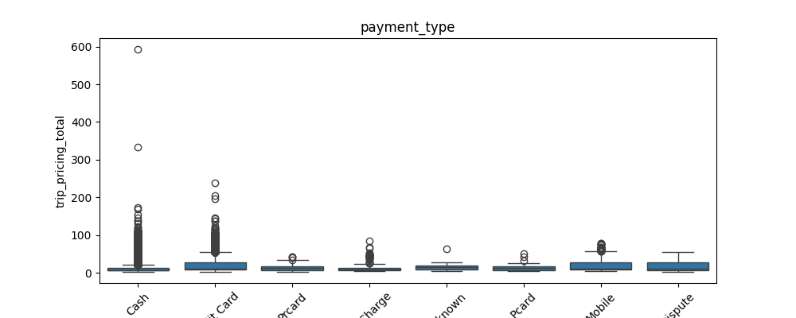
        - 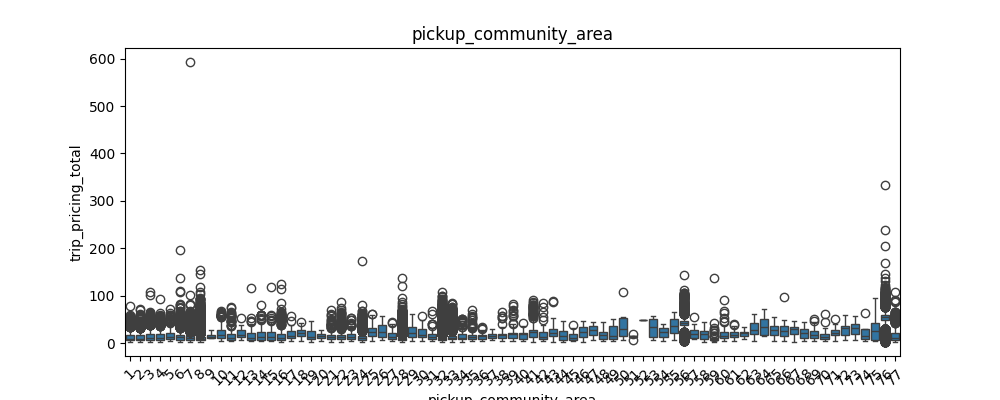
        - 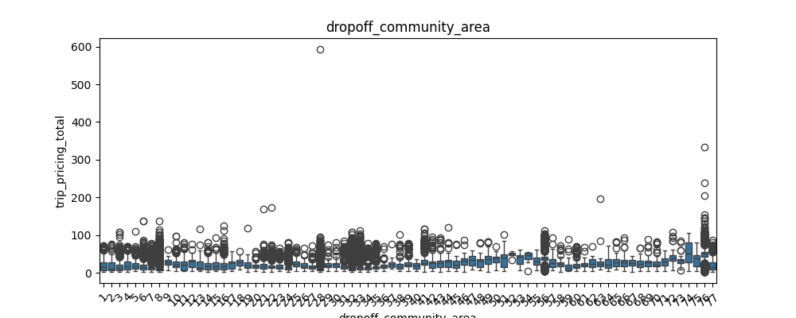
    - 数据标准化
        - trip_pricing_total 过滤超过3000的极端大值，防止异常值影响分析，
        - payment_type 只保留付款方式为“Credit Card”或“Cash”的数据，排除其他付款方式的样本。并且进行二进制编码
            - 将数据缩放到一个标准区间，比如0到1之间，或者-1到1之间，这样可以加快模型的收敛速度，提高模型的稳定性。
        - trip_start_timestamp 转换为pandas的日期时间格式。
        - dayofweek 提取星期几（0=周一，6=周日），并生成新列
            - 将数据缩放到一个标准区间，比如0到6之间，这样可以加快模型的收敛速度，提高模型的稳定性。
                -  按星期分组，计算 trip_pricing_total 的总和
                -  按星期分组，计算 trip_pricing_total 的平均值
                - 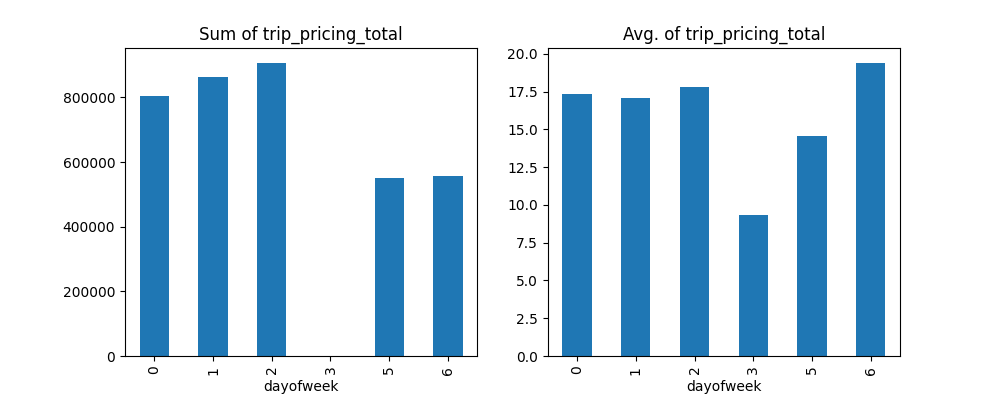
        - hour 提取小时（0~23），生成新的特征列。
            - 将数据缩放到一个标准区间，比如0到23之间，这样可以加快模型的收敛速度，提高模型的稳定性。
                -  按小时分组，计算 trip_pricing_total 的总和
                -  按小时分组，计算 trip_pricing_total 的平均值
                - 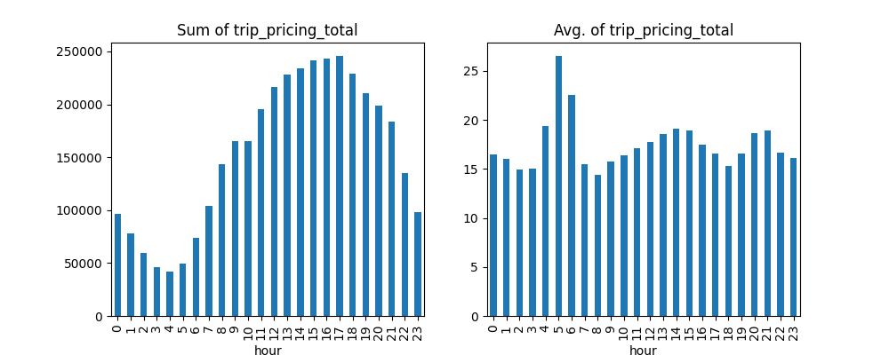
- 超参数调优 → 正则化：L2 正则化，防止过拟合并提升模型稳定性
  - 使用 GridSearchCV 对 alpha 进行搜索
  - alpha 控制正则化强度
    - 值越小 → 更接近普通线性回归（可能过拟合）
    - 值越大 → 系数被更强约束（可能欠拟合）

-------
## 本地模型评估
### 评估岭回归模型在训练集和测试集上的性能指标
1️⃣ R2-score（决定系数）
- 表示模型对数据的拟合程度，取值范围通常是 (-∞, 1]
- 1.0 → 模型完美拟合
- 0 → 模型的预测效果和简单用均值预测一样
- 负值 → 模型预测比均值预测还差
- 计算公式：
    - 公式：
    - 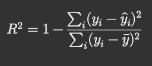

2️⃣ RMSE（Root Mean Squared Error，均方根误差）
- 衡量模型预测值与真实值的平均误差，单位与目标变量相同
- 越小 → 模型预测越准确
- 计算公式：
    - 公式：
    - 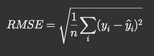

3️⃣ Train vs Test
- Train R2-score / RMSE → 模型在训练集上的表现
- Test R2-score / RMSE → 模型在测试集（未见过的数据）上的表现

4️⃣ Train vs Test Output 对比 → 模型在训练集上的表现与在测试集上的表现:
```shell
Train R2-score: 0.9372001547050591 Train RMSE: 4.078162653552752
Test R2-score: 0.918233628007016 Test RMSE: 4.706298492661179
```
-------

## 可解释性分析&特征归因可视化：
- 准备测试样本：从测试集选取前两条数据，转换成列表格式，作为请求 payload。
    - test_json = [X_test.iloc[0].tolist(), X_test.iloc[1].tolist()]    
- 调用 Explain API：使用 aiplatform.Endpoint.explain() 向端点发送样本，请求预测结果及特征归因。
    - response = endpoint.explain(instances=test_json)
- 打印结果：
	- 输出预测值
	- 输出基线值、预测值、误差等信息
	- 展示每个特征对预测的贡献（feature attributions）
    - 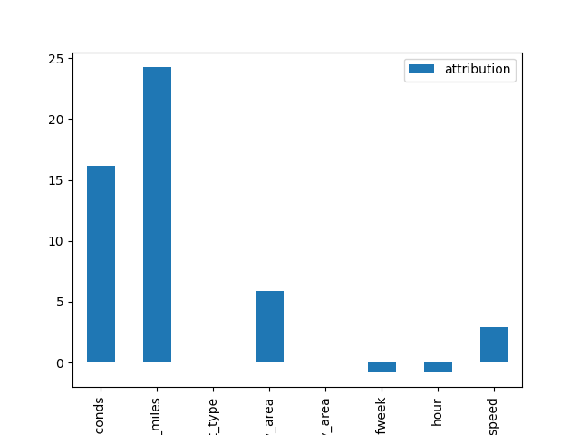
    - 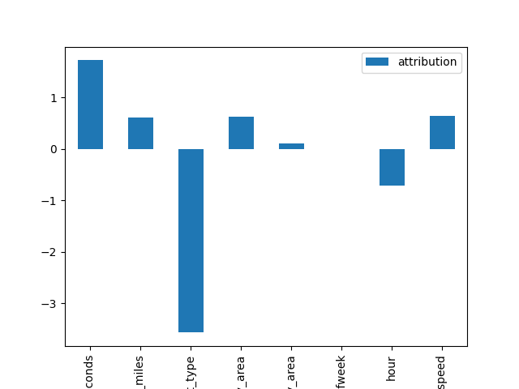


-------
### 示例输出

```python

模型性能

训练集 R² 分数: 0.9372001547050591783 训练集 RMSE: 4.078162653552752
测试集 R² 分数: 0.918233628007016779 测试集 RMSE: 4.706298492661179

示例解释结果
##########Explanations##########
 explanation
  attribution
   baseline_output_value: 3.8885688650039567 基线预测值，比如模型在没有输入特征时的默认输出（类似“起点”）。
   instance_output_value: 7.835568915449318  当前样本模型的预测值。
   output_display_name: 模型输出的可读名称，这里是空的。
   approximation_error: 1.0767001030476328e-18  归因计算的近似误差，越小越好，表明解释结果准确。
   output_name: Predicted_taxi_fare   模型输出的名字，这里是 Predicted_taxi_fare，即出租车费用预测
   output_index: -1
 explanation
  attribution
   baseline_output_value: 3.8885688650039567
   instance_output_value: 12.469287764089437
   output_display_name: 
   approximation_error: 3.860452983579596e-19
   output_name: Predicted_taxi_fare
   output_index: -1
##########Predictions##########
7.835568915449318
12.46928776408944

```

-------
## remote模型评估
### 评估岭回归模型在训练集和测试集上的性能指标
1️⃣ R2-score（决定系数）
- 表示模型对数据的拟合程度，取值范围通常是 (-∞, 1]
- 1.0 → 模型完美拟合
- 0 → 模型的预测效果和简单用均值预测一样
- 负值 → 模型预测比均值预测还差
- 计算公式：
    - 公式：
    - 

2️⃣ RMSE（Root Mean Squared Error，均方根误差）
- 衡量模型预测值与真实值的平均误差，单位与目标变量相同
- 越小 → 模型预测越准确
- 计算公式：
    - 公式：
    - 

3️⃣ Train vs Test
- Train R2-score / RMSE → 模型在训练集上的表现
- Test R2-score / RMSE → 模型在测试集（未见过的数据）上的表现

4️⃣ Train vs Test Output 对比 → 模型在训练集上的表现与在测试集上的表现:
```shell
Train R2-score: 0.9372065008947004 Train RMSE: 4.077956590565338
Test R2-score: 0.918217368308735 Test RMSE: 4.706766406228629
```
- 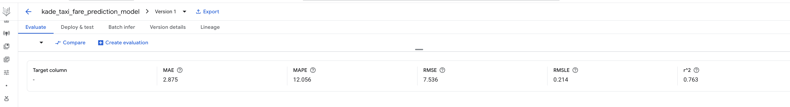
- 

-------

## 可解释性分析&特征归因可视化：
- 准备测试样本：从测试集选取前两条数据，转换成列表格式，作为请求 payload。
    - evaluation_create_tables.py    
- 调用 Explain API：使用 aiplatform.Endpoint.explain() 向端点发送样本，请求预测结果及特征归因。
    - response = endpoint.explain(instances=test_json)
- 打印结果：
	- 输出预测值
	- 输出基线值、预测值、误差等信息
	- 展示每个特征对预测的贡献（feature attributions）
    - 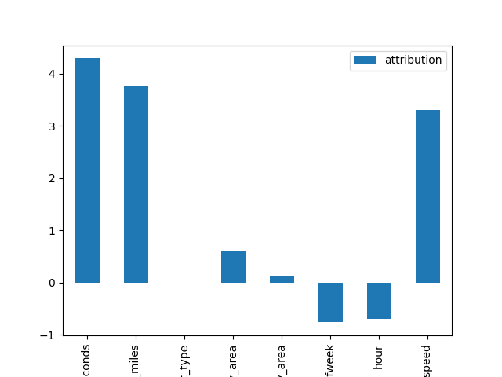
    - 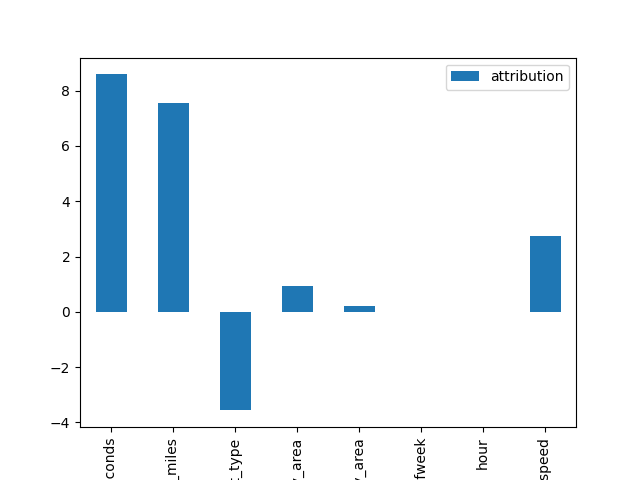

-------
## 💡 核心收获
- 使用 BigQuery 提取和清洗数据。
- 特征工程和预测建模。
- 使用 Scikit-learn 训练模型并评估性能。
- 将模型上传、部署到 Vertex AI。
- 生成 Sampled Shapley 可解释性结果。

-------

## 后续优化方向
- 尝试更复杂模型（如 XGBoost、神经网络）。
- 部署支持自动扩缩容和监控。
- 集成实时预测 API。

-------

© 2025 Kade Chen